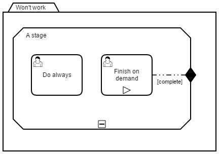
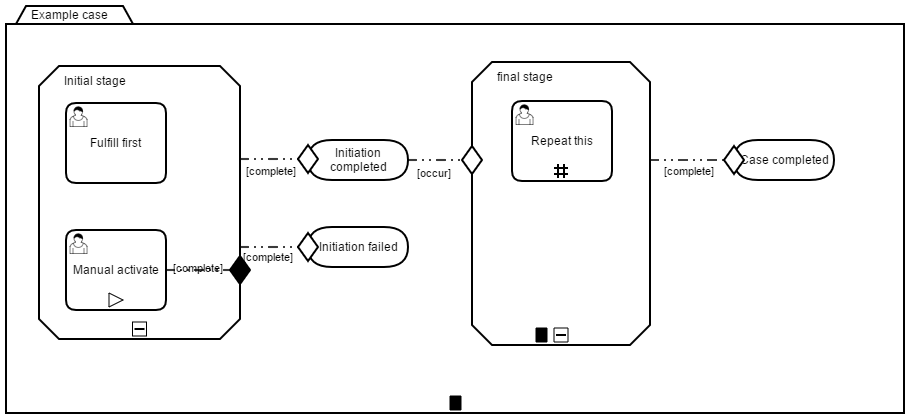

# Example to show BPMN and CMMN together

Example file with:

- BPMN calling CMMN (sub)case
- Passing variables

in CMMN:
- milestone
- sentry
- stage
- discretionary or manually activated task
- repetitive task
- entry/exit criterion

in BPMN:
- Driving gateways based on CMMN variable/result"

## Hidden Elements

There is a listener on the case completed milestone, that sets a caseExecution variable `caseSuccessful` to `true`.

## Findings

1. Case called from a process could not use exit criterions.
Exit criterions mark the case as TERMINATED, but the process continues after the case is COMPLETED. Use the autoComplete marker instead.

2. Stages could not be terminated by completing a single (manually activated) human task.

See [https://app.camunda.com/jira/browse/CAM-6087](https://app.camunda.com/jira/browse/CAM-6087) and the linked forum posts for further details.
Workarounds: 
	- Mark the stage with autoComplete.
	- Terminate the other tasks with a task listener on `complete` event. See [CompleteStageListener.java](src/main/java/com/camunda/consulting/bpmn_cmmn_example/CompleteStageListener.java) for details. 
This task listener isn't able to terminate available tasks (the ones with entry criterion) directly, they have to be in the state `active`. This is the error message:
```
ENGINE-05011 Could not perform transition 'terminate on case execution with id '419'.Reason: The case execution must be in state 'active' to terminate, but it was in state 'available'
```
Go for the autoComplete, here it works.

3. Entry criterions can check if a variable has a certain value. But this variable has to be initialized (even empty) before, otherwise you will get a `Unknown property used in expression` exception. Workaround is to call the Java-API in the expression:
```
${caseExecution.hasVariable("customerValueChanged")}
```

4. If you want to use beans with certain evaluation logic in entry criterions, the most easy way to trigger the evaluation on a change in bean state, is to set a case variable and include it in the ifPart:
```
<cmmn:ifPart id="IfPart_1">
    <cmmn:condition id="Expression_1"><![CDATA[${caseExecution.hasVariable("customerValueChanged") && customerValueBean.isValueHighEnough()}]]></cmmn:condition>
</cmmn:ifPart>
```
The activation of the Conditional activate task may look like this:
```
customerValueBean.setCustomerValue(1001);
caseService().setVariable(caseInstance.getCaseInstanceId(), "customerValueChanged", true);
```

## Show me the important parts!


## How does it work?

## How to use it?
There is no web interface to access the application.
To get started refer to the `InMemoryH2Test`.

There is also an `ArquillianTest`, which by default connects to a
Camunda BPM platform running locally on a JBoss Wildfly application server.
You can download a Camunda BPM distribution for JBoss from the
[Camunda BPM download page](http://camunda.org/download/).

You can also use `ant` to build and deploy the example to an application server.
For that to work you need to copy the file `build.properties.example` to `build.properties`
and configure the path to your application server inside it.
Alternatively, you can also copy it to `${user.home}/.camunda/build.properties`
to have a central configuration that works with all projects generated by the
[Camunda BPM Maven Archetypes](http://docs.camunda.org/latest/guides/user-guide/#process-applications-maven-project-templates-archetypes).

Once you deployed the application you can run it using
[Camunda Tasklist](http://docs.camunda.org/latest/guides/user-guide/#tasklist)
and inspect it using
[Camunda Cockpit](http://docs.camunda.org/latest/guides/user-guide/#cockpit).

## Environment Restrictions
Built and tested against Camunda BPM version 7.7.0.

## Known Limitations

## Improvements Backlog

## License
[Apache License, Version 2.0](http://www.apache.org/licenses/LICENSE-2.0).

<!-- HTML snippet for index page
  <tr>
    <td></td>
    <td><a href="snippets/bpmn-cmmn-example">Camunda BPM Process Application</a></td>
    <td>A Process Application for [Camunda BPM](http://docs.camunda.org).</td>
  </tr>
-->
<!-- Tweet
New @CamundaBPM example: Camunda BPM Process Application - A Process Application for [Camunda BPM](http://docs.camunda.org). https://github.com/camunda/camunda-consulting/tree/master/snippets/bpmn-cmmn-example
-->